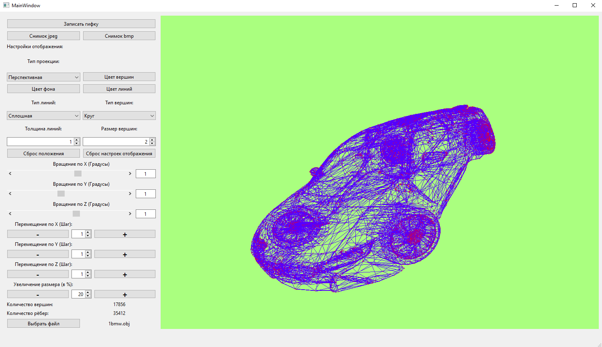

# 3D Viewer

## Описание

**Stack**: C++, Qt;

Программа для просмотра 3D-моделей, представленных в виде .obj файлов, с возможностью изменения положения фигуры в пространстве, настройки параметров ее отображения, а также возможностью сохранения скриншота и анимированной GIF-картинки.

Рисунок 1 - Интерфейс программы

* Программа реализована с использованием паттерна MVC;

* Работа с 3D-моделями, описанными в формате .obj;

* Возможность управления положением фигуры в пространстве (вращение, перемещение, изменение размера);

* Выбор настроек отображения: цвет фона, ребер, вершин, их размеров;

* Возможность сохранения изображений в формате bmp и jpeg;

* Возможность сохранения загруженного объекта в gif-анимацию.

## Сборка

**Linux (Mac OS)**: перейти в папку src, выполнить цель`make install`, программа будет лежать в директории build;

**Windows:** Открыть в Qt-Creator файл src/view/Viewer/Viewer.pro, запустить программу

  
